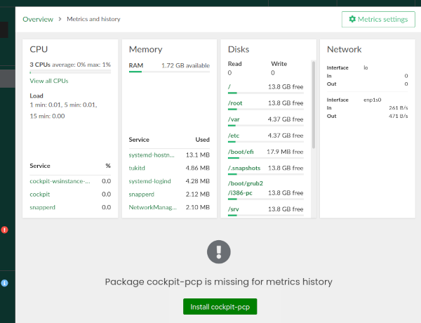
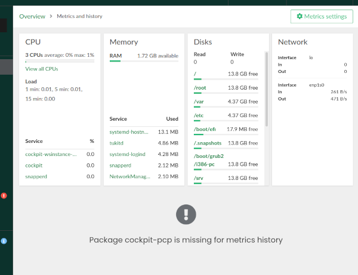

# Challenges Administering Transactional Systems

## Software Installation

### Current Status in Cockpit and YaST

There are situations in which Cockpit or the containerized version of YaST would need to install
software in the managed system.

In the case of Cockpit this only happens in the "Metrics" section, where it can offer the option to
install and configure `cockpit-pcp` (and its dependencies) or `redis`. It's specially visible in the
button displayed in the following screenshot.

On the one hand, Cockpit relies on PackageKit to perform the installation. On the other hand,
Cockpit can detect when a system is transactional. So at the current state, Cockpit will only
display such a button if PackageKit is available and the system is NOT transactional. In any other
case, the screen looks like the one shown below, in which the possibility to install the package is
mentioned but Cockpit offers no means or even advise about how to install it.

As explained, that behavior is fully intended, as exposed by the following quote from an upstream
Cockpit developer. "_We do not intend to transparently do overlay installs on ostree [...] that's
not how you are supposed to use CoreOS. So Cockpit should just not offer on-demand installation
there._"

In the case of containerized YaST, it's relatively common to request the installation of packages in
the system to be managed. Let's say the user executes the YaST module to manage KDump in a system in
which the package `kdump` is not installed. YaST will ask the user to install that package,
otherwise the configuration doesn't make much sense. In a non-transactional system, YaST would take
care of the installation of the software by itself and the user would only have to accept it. Then
YaST would install the package and continue its execution normally. Depending on the concrete YaST
module, that could happen at the beginning of the execution or at any point in time in which the
package is determined to be needed (eg. when writing the changes to the system once the user has
reviewed and accepted the configuration).

Since that cannot work in a transactional system, a workaround was recently introduced in YaST. If
running in a transactional system, YaST will show a message like the following instead of managing
the installation of the package by itself.

### Open Questions

- Is the current approach of both Cockpit and containerized YaST enough?

- Should we aim for a more guided approach in which the 1:1 management tool guides the user through
  the installation of the software and the corresponding reboot?

- If so, should that be implemented directly in the tools or do we envision something like PackageKit
  support for transactional systems? Or maybe some new layer that works with PackageKit and/or tukit
  depending on the case?

### Point of View of the ALP Steering Committee

Jiri Srain and Frederic Crozat feel that just mentioning the missing packages may not be enough.
It would be better if Cockpit and YaST would offer a relatively guided way to install the packages
and reboot.

That procedure may not help in those scenarios that are fully image-based (in which installing
packages is pointless because they will go away with next image deployment/update). But it's fine to
ignore those scenarios for now, since they are likely out of scope of 1:1 management systems in
general.

Regarding the question about what should be the right layer to implement package installation, it
is NOT expected from PackageKit to get transactional-update support anytime soon.

## Management of dependencies

### Current Status in Cockpit and YaST

Related to the previous section about software installation, it's worth noticing that there is a
kind of philosophical difference in the way both containerized YaST and Cockpit approach to package
dependencies.

YaST shows all the possible functionality, no matter which packages are present in the system.
Then, if the user wants to use a certain functionality YaST asks the user to install the
corresponding missing packages and reboot.

On the other hand, Cockpit only shows the functionality that is available with the currently
installed packages. Eg. if `cockpit-storaged` is not installed, there will be no clue in the Cockpit
interface about the possibility of managing storage devices with Cockpit. If the user finds out and
decides to install `cockpit-storaged`, then all the packages that it would need (like UDisks2 or
several file-system tools) will be dragged into the system as dependencies of the `cockpit-storaged`
package.

The only exception to the usual Cockpit approach of not displaying any clue in the interface about
uninstalled functionality is the explicit mention to `cockpit-pcp` already exposed in the previous
section of this document.

### Open Question

- Should the containerized YaST, when running in a transactional system, adopt an approach closer to
  the Cockpit one and only display the modules that can be fully used without installing additional
  software into the system?

### Point of View of the ALP Steering Committee

Jiri Srain said: "_I would not judge whether all functionality is available with currently installed
packages, but on a per-plugin basis decide whether it can be used for majority of common scenarios
and then offer it even if not all functionality is available._"
